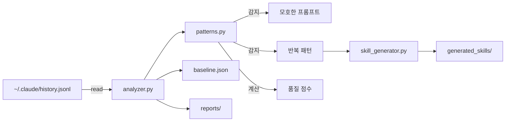
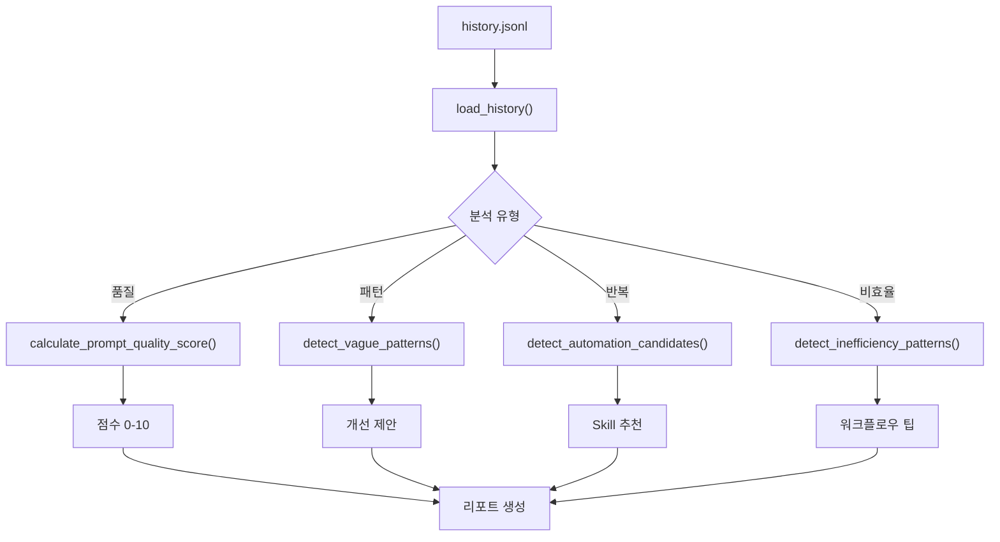
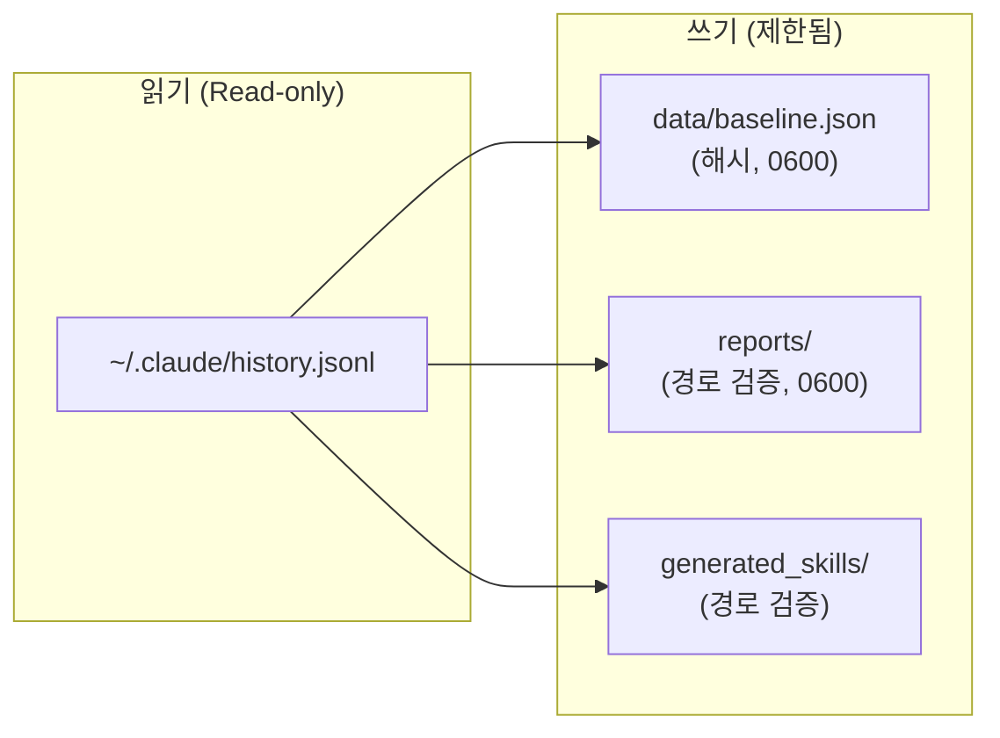
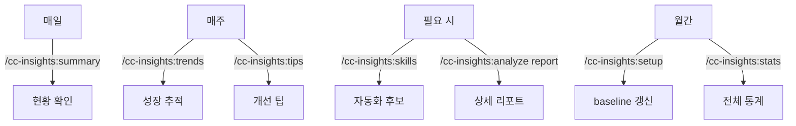

# cc-insights

Claude Code 사용 패턴을 분석하여 **개인화된 인사이트와 구체적 액션**을 제안하는 Plugin

## 특징

- **개인화된 프로필** - 나의 개발 스타일, 강점/약점 분석
- **한국어 특화** - 한국어 프롬프트 패턴 감지, 한국어 피드백
- **baseline 비교** - 전체 히스토리 대비 최근 변화 추적
- **skill 자동 생성** - 반복 패턴 감지 시 skill 코드 제안
- **트렌드 분석** - 주간/월간 성장 추적
- **보안 설계** - 민감 정보 마스킹, 경로 제한, 외부 의존성 제로

## 구조



## 설치

### GitHub에서 설치

```bash
# 1. 클론
git clone https://github.com/Taehyeon-Kim/cc-insights.git ~/.cc-insights

# 2. 커맨드 심링크 등록
ln -s ~/.cc-insights/commands/cc-insights:*.md ~/.claude/commands/

# 3. Claude Code에서 초기 설정
/cc-insights:setup
```

## 빠른 시작

### 1. 초기 설정 (온보딩)

```bash
/cc-insights:setup
```

전체 히스토리를 분석하여 개인화된 프로필과 baseline을 생성합니다.

**출력 예시:**

```
cc-insights 온보딩 분석 완료
-----------------------------------------
  분석 기간: 2025-11-11 ~ 2026-01-14 (65일)
  총 프롬프트: 7,443개
  하루 평균: 114.5개
  종합 등급: A
-----------------------------------------

당신의 개발 프로필
  - 작업 스타일: 나이트 아울 (저녁 집중형)
  - 세션 스타일: 딥다이브 (긴 세션 선호)
  - 프로젝트 스타일: 멀티태스커 (다중 프로젝트)
  - 프롬프트 스타일: 적정파 (적절한 길이)
```

### 2. 일상적인 사용

```bash
/cc-insights:summary          # 빠른 현황 확인 (매일)
/cc-insights:tips             # 개인화된 팁
/cc-insights:trends           # 주간 트렌드
/cc-insights:skills           # skill 추천 목록
/cc-insights:analyze          # 상세 분석
/cc-insights:projects         # 프로젝트별 분석
/cc-insights:stats            # 전체 사용 통계
```

## 명령어 상세

### `/cc-insights:setup` - 초기 설정

최초 설치 시 실행하여 전체 히스토리를 분석합니다.

**제공 정보:**
- 개발 프로필 (작업 스타일, 세션 스타일, 프로젝트 스타일)
- 강점/약점 분석 및 종합 등급 (S/A/B/C/D)
- Skill 자동화 추천 (신뢰도 포함)
- 구체적인 액션 아이템
- 주요 프로젝트 현황
- 작업 시간 패턴

---

### `/cc-insights:summary` - 빠른 요약

매일 확인하기 좋은 간단한 현황 요약입니다.

```bash
/cc-insights:summary              # 최근 7일
/cc-insights:summary --days 14    # 최근 14일
```

**출력 예시:**

```
cc-insights 빠른 요약 (최근 7일)
-----------------------------------------
  오늘: 45개 (평균 대비 +32%)
  총 프롬프트: 312개 | 품질: 8.2/10
  모호한 프롬프트: 28개 (9.0%)
-----------------------------------------
  추천: /commit skill 생성 (23회 반복)
```

---

### `/cc-insights:tips` - 개인화된 팁

사용 패턴을 분석하여 맞춤형 개선 팁을 제공합니다.

**팁 생성 기준:**
- 작업 스타일 (야간 작업 → handoff 권장)
- 세션 스타일 (긴 세션 → /compact 권장)
- 프롬프트 스타일 (짧은 프롬프트 → 구체화 권장)
- 비효율 패턴 (/clear 과다 → claude --continue 권장)

**우선순위:**
- `HIGH` - 즉시 적용 권장
- `MEDIUM` - 점진적 개선
- `LOW` - 선택적 적용

---

### `/cc-insights:trends` - 트렌드 분석

최근 N주간의 사용 패턴 변화를 분석합니다.

```bash
/cc-insights:trends              # 최근 4주
/cc-insights:trends --weeks 8    # 최근 8주
```

---

### `/cc-insights:skills` - Skill 관리

반복 패턴을 분석하여 자동화할 skill을 추천합니다.

```bash
/cc-insights:skills                      # 추천 목록
/cc-insights:skills generate commit      # skill 코드 생성
```

**추천 기준:**
- 3회 이상 반복된 패턴
- 신뢰도 = 반복 횟수에 비례 (최대 95%)

**감지 가능한 패턴:**

| 패턴 | Skill | 설명 |
|------|-------|------|
| 로그 확인 | `/log-check` | 로그 확인 및 에러 분석 |
| 핸드오프 작성 | `/handoff` | 핸드오프 문서 자동 작성 |
| 커밋 | `/commit` | 변경사항 커밋 |
| 배포 진행 | `/deploy` | 배포 및 상태 확인 |
| 테스트 실행 | `/run-tests` | 테스트 실행 및 결과 분석 |

---

### `/cc-insights:analyze` - 상세 분석

전체적인 상세 분석 리포트를 생성합니다.

```bash
/cc-insights:analyze                # 요약 출력
/cc-insights:analyze --days 30      # 30일 분석
/cc-insights:analyze report         # 마크다운 파일 저장
```

**분석 항목:**
1. 프롬프트 품질 점수 (0-10)
2. 반복 패턴 → Skill 제안
3. 비효율 패턴 감지
4. 시간/프로젝트 패턴

## 분석 기능 상세

### 분석 흐름



### 개발 프로필

| 카테고리 | 유형 |
|----------|------|
| 작업 스타일 | 얼리버드 / 나이트아울 / 심야형 / 균형형 |
| 세션 스타일 | 딥다이브 / 스프린터 / 밸런서 |
| 프로젝트 스타일 | 집중형 / 포커스형 / 멀티태스커 |
| 프롬프트 스타일 | 상세파 / 간결파 / 적정파 |

### 품질 점수 계산

```
기본: 10점
- 길이 < 10자: -3점
- 길이 < 20자: -1점
- 지시대명사(이거, 저거) 사용: -2점
- 모호한 동사만 사용: -3점
+ 파일 경로 포함: +1점
+ 구체적 명령어(npm, git, pm2) 포함: +1점
+ 에러 메시지 포함: +0.5점
```

### 모호한 프롬프트 감지

| 패턴 | 문제 | 개선 예시 |
|------|------|----------|
| "이거 확인" | 지시대명사 | 무엇을 가리키는지 명시 |
| "확인해줘" | 대상 미지정 | "pm2 logs에서 ERROR 확인" |
| "커밋" | 단일 키워드 | 옵션이나 범위 명시 |
| "로그" | 대상 불명확 | "pm2 logs --lines 100" |

## 보안



- **민감 정보 마스킹**: API키, JWT, URL 크레덴셜 자동 `[REDACTED]` 처리
- **프롬프트 비저장**: baseline에 원문 대신 `sha256[:12]` 해시 저장
- **경로 제한**: `--output`은 `reports/` 내부만 허용, path traversal 차단
- **파일 권한**: 민감 파일 `0600` (소유자만 읽기/쓰기)
- **외부 의존성 제로**: Python 표준 라이브러리만 사용
- **네트워크 통신 없음**: 모든 데이터는 로컬에서만 처리

## 파일 구조

```
cc-insights/
├── .claude-plugin/
│   ├── plugin.json
│   └── marketplace.json
├── commands/
│   ├── cc-insights:setup.md        # 초기 설정
│   ├── cc-insights:analyze.md      # 상세 분석
│   ├── cc-insights:summary.md      # 빠른 요약
│   ├── cc-insights:tips.md         # 개인화된 팁
│   ├── cc-insights:trends.md       # 트렌드 분석
│   ├── cc-insights:skills.md       # Skill 관리
│   ├── cc-insights:projects.md     # 프로젝트별 분석
│   └── cc-insights:stats.md        # 전체 통계
├── scripts/
│   ├── analyzer.py                 # 메인 분석 엔진
│   ├── patterns.py                 # 패턴 감지 모듈
│   └── skill_generator.py          # Skill 코드 생성
├── data/
│   └── baseline.json               # 전체 히스토리 baseline (gitignored)
├── reports/                        # 저장된 리포트 (gitignored)
└── generated_skills/               # 생성된 Skill 파일 (gitignored)
```

## 추천 사용 패턴



## 기술 스택

- **언어**: Python 3 (표준 라이브러리만 사용)
- **분석**: 정규식 기반 패턴 매칭
- **저장소**: JSON (baseline, 리포트)
- **출력**: CLI, Markdown

## 라이선스

MIT
