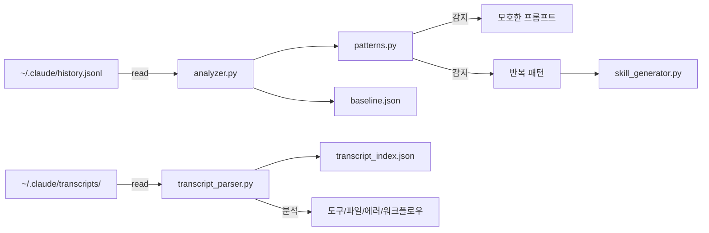

# cc-insights

Claude Code 사용 패턴을 분석하여 **개인화된 인사이트와 구체적 액션**을 제안하는 Plugin

## 특징

- **프롬프트 분석** - `history.jsonl` 기반 품질 점수, 모호한 프롬프트 감지
- **트랜스크립트 분석** - `transcripts/` 기반 도구 사용, 파일 활동, 에러/워크플로우 패턴
- **개인화된 프로필** - 나의 개발 스타일, 강점/약점 분석
- **baseline 비교** - 전체 히스토리 대비 최근 변화 추적
- **skill 자동 생성** - 반복 패턴 감지 시 skill 코드 제안
- **한국어 특화** - 한국어 프롬프트 패턴 감지, 한국어 피드백
- **보안 설계** - 민감 정보 마스킹, 경로 제한, 외부 의존성 제로

## 구조



## 설치

```bash
# 1. 마켓플레이스 등록
claude plugin marketplace add Taehyeon-Kim/cc-insights

# 2. 플러그인 설치
claude plugin install cc-insights@cc-insights

# 3. 초기 설정
/cc-insights:setup
```

## 빠른 시작

### 1. 초기 설정 (온보딩)

```
/cc-insights:setup
```

전체 히스토리를 분석하여 개인화된 프로필과 baseline을 생성합니다.

**출력 예시:**

```
cc-insights 온보딩 분석 완료
-----------------------------------------
  분석 기간: 2025-11-11 ~ 2026-01-14 (65일)
  총 프롬프트: 7,443개
  하루 평균: 114.5개
  종합 등급: A
-----------------------------------------

당신의 개발 프로필
  - 작업 스타일: 나이트 아울 (저녁 집중형)
  - 세션 스타일: 딥다이브 (긴 세션 선호)
  - 프로젝트 스타일: 멀티태스커 (다중 프로젝트)
  - 프롬프트 스타일: 적정파 (적절한 길이)
```

### 2. 일상적인 사용

```bash
/cc-insights:summary          # 빠른 현황 확인 (매일)
/cc-insights:tips             # 개인화된 팁
/cc-insights:trends           # 주간 트렌드
/cc-insights:skills           # skill 추천 목록
/cc-insights:analyze          # 상세 분석
/cc-insights:transcript       # 트랜스크립트 분석
/cc-insights:projects         # 프로젝트별 분석
/cc-insights:stats            # 전체 사용 통계
```

## 명령어 상세

### `/cc-insights:setup` - 초기 설정

최초 설치 시 실행하여 전체 히스토리를 분석합니다.

**제공 정보:**
- 개발 프로필 (작업 스타일, 세션 스타일, 프로젝트 스타일)
- 강점/약점 분석 및 종합 등급 (S/A/B/C/D)
- Skill 자동화 추천 (신뢰도 포함)
- 구체적인 액션 아이템
- 주요 프로젝트 현황
- 작업 시간 패턴

---

### `/cc-insights:summary` - 빠른 요약

매일 확인하기 좋은 간단한 현황 요약입니다.

```bash
/cc-insights:summary              # 최근 7일
/cc-insights:summary --days 14    # 최근 14일
```

**출력 예시:**

```
cc-insights 빠른 요약 (최근 7일)
-----------------------------------------
  오늘: 45개 (평균 대비 +32%)
  총 프롬프트: 312개 | 품질: 8.2/10
  모호한 프롬프트: 28개 (9.0%)
-----------------------------------------
  추천: /commit skill 생성 (23회 반복)
```

---

### `/cc-insights:transcript` - 트랜스크립트 분석

`~/.claude/transcripts/`의 전체 대화 기록을 분석하여 도구 사용 패턴, 파일 활동, 에러/워크플로우 패턴을 제공합니다.

```bash
/cc-insights:transcript                              # 종합 요약 (7일)
/cc-insights:transcript --days 30                    # 30일 분석
/cc-insights:transcript --transcript-sub tools       # 도구 분포 상세
/cc-insights:transcript --transcript-sub files       # 파일 활동
/cc-insights:transcript --transcript-sub errors      # 에러 패턴
/cc-insights:transcript --transcript-sub efficiency  # 세션 효율성
/cc-insights:transcript --transcript-sub workflows   # 워크플로우 패턴
```

**출력 예시:**

```
cc-insights 트랜스크립트 분석 (최근 30일)
━━━━━━━━━━━━━━━━━━━━━━━━━━━━━━━━━━━━━━━━━━━━━━━━━━━━━━━━
  분석 대상: 824개 세션 / 21,756개 도구 호출

  도구 사용 분포
   1. read               [████████████████████] 5,897회 (27.1%)
   2. bash               [███████████████████░] 5,793회 (26.6%)
   3. edit               [██████░░░░░░░░░░░░░░] 2,059회 (9.5%)

  자주 수정된 파일 (Top 5)
  1. src/api/v1/__init__.py           12회 (edit)
  2. src/services/trading.py           12회 (edit)

  에러 패턴
  총 에러: 618개 (에러율: 2.8%)
  - bash (exit=1): 425건

  워크플로우 패턴
  1. bash → bash                     (256회) 연속 명령 실행
  2. read → read                     (168회) 다중 파일 읽기

  세션 효율성
  평균 세션: 40.3분 | 도구 밀도: 7.8회/분 | 에러율: 3.0%
```

**캐시**: 최초 빌드 후 증분 업데이트로 수초 내 완료.

---

### `/cc-insights:tips` - 개인화된 팁

사용 패턴을 분석하여 맞춤형 개선 팁을 제공합니다.

**팁 생성 기준:**
- 작업 스타일 (야간 작업 → handoff 권장)
- 세션 스타일 (긴 세션 → /compact 권장)
- 프롬프트 스타일 (짧은 프롬프트 → 구체화 권장)
- 비효율 패턴 (/clear 과다 → claude --continue 권장)

---

### `/cc-insights:trends` - 트렌드 분석

최근 N주간의 사용 패턴 변화를 분석합니다.

```bash
/cc-insights:trends              # 최근 4주
/cc-insights:trends --weeks 8    # 최근 8주
```

---

### `/cc-insights:skills` - Skill 관리

반복 패턴을 분석하여 자동화할 skill을 추천합니다.

```bash
/cc-insights:skills                      # 추천 목록
/cc-insights:skills generate commit      # skill 코드 생성
```

---

### `/cc-insights:analyze` - 상세 분석

전체적인 상세 분석 리포트를 생성합니다.

```bash
/cc-insights:analyze                # 요약 출력
/cc-insights:analyze --days 30      # 30일 분석
/cc-insights:analyze report         # 마크다운 파일 저장
```

**분석 항목:**
1. 프롬프트 품질 점수 (0-10)
2. 반복 패턴 → Skill 제안
3. 비효율 패턴 감지
4. 시간/프로젝트 패턴

## 데이터 소스

| 소스 | 파일 | 분석 내용 |
|------|------|-----------|
| 프롬프트 히스토리 | `~/.claude/history.jsonl` | 품질 점수, 모호한 프롬프트, 반복 패턴, 시간/프로젝트 패턴 |
| 트랜스크립트 | `~/.claude/transcripts/*.jsonl` | 도구 사용 분포, 파일 활동, 에러 패턴, 워크플로우, 세션 효율성 |

## 보안

- **민감 정보 마스킹**: API키, JWT, URL 크레덴셜 자동 `[REDACTED]` 처리
- **프롬프트 비저장**: baseline에 원문 대신 `sha256[:12]` 해시 저장
- **경로 제한**: `--output`은 `reports/` 내부만 허용, path traversal 차단
- **파일 권한**: 민감 파일 `0600` (소유자만 읽기/쓰기)
- **외부 의존성 제로**: Python 표준 라이브러리만 사용
- **네트워크 통신 없음**: 모든 데이터는 로컬에서만 처리

## 파일 구조

```
cc-insights/
├── .claude-plugin/
│   ├── plugin.json
│   └── marketplace.json
├── commands/
│   ├── cc-insights:setup.md        # 초기 설정
│   ├── cc-insights:analyze.md      # 상세 분석
│   ├── cc-insights:summary.md      # 빠른 요약
│   ├── cc-insights:tips.md         # 개인화된 팁
│   ├── cc-insights:trends.md       # 트렌드 분석
│   ├── cc-insights:skills.md       # Skill 관리
│   ├── cc-insights:projects.md     # 프로젝트별 분석
│   ├── cc-insights:stats.md        # 전체 통계
│   └── cc-insights:transcript.md   # 트랜스크립트 분석
├── scripts/
│   ├── analyzer.py                 # 메인 분석 엔진
│   ├── transcript_parser.py        # 트랜스크립트 파서
│   ├── patterns.py                 # 패턴 감지 모듈
│   └── skill_generator.py          # Skill 코드 생성
├── data/
│   ├── baseline.json               # 히스토리 baseline (gitignored)
│   └── transcript_index.json       # 트랜스크립트 인덱스 캐시 (gitignored)
├── reports/                        # 저장된 리포트 (gitignored)
└── generated_skills/               # 생성된 Skill 파일 (gitignored)
```

## 기술 스택

- **언어**: Python 3 (표준 라이브러리만 사용)
- **분석**: 정규식 기반 패턴 매칭, n-gram 워크플로우 감지
- **캐시**: 증분 업데이트 인덱스 (mtime 기반)
- **출력**: CLI, Markdown

## 라이선스

MIT
